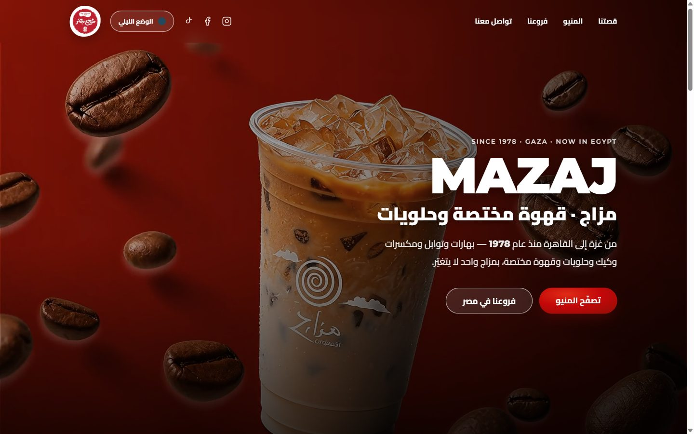
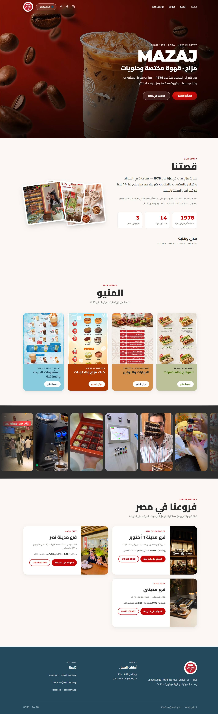

<div align="center">

# مزاج · Mazaj — قهوة مختصة وحلويات

**A right-to-left, image-led landing site for a specialty-coffee and dessert brand.**
Single page, hand-built, no framework and no build step.

HTML · CSS · Vanilla JS

### ▶ [View the live site](https://7km-69.github.io/mazaj-cafe-website/)



</div>

---

## What this is

A single-page site for **Mazaj (مزاج)** — the Egypt arm of *بدري وهنية*, a spice, nut, cake and
specialty-coffee house that started in **Gaza in 1978** and now runs three branches in Cairo.

The page is Arabic-first and fully RTL: a full-screen video hero behind a progress-tracking preloader,
the brand's origin story with counting statistics and a fanned photo deck, four menu categories that
fan open into a modal, a strip of looping reels, and the three branches with their real addresses,
hours and phone numbers.

It's a **front-end / brand site**: no backend, no checkout. The craft is in the layout, the type, the
image treatment, and the motion.

## The full page



## Features

- **Arabic-first and fully RTL.** Logical properties throughout; Latin strings carry their own
  `dir` so bidi never reorders a phone number or a branch name.
- **A video hero with an honest preloader.** The loading bar tracks four real assets and dismisses
  itself on a hard 6-second cap, so a slow network delays the page but never traps it. The hero copy
  ships in the HTML and is re-hydrated from `content/hero-content.json`, so a failed fetch still
  leaves a complete hero.
- **Light and dark mode.** Resolved before first paint from `localStorage` or the OS preference, so
  the page never flashes the wrong theme. One toggle in the header.
- **A reel strip that actually plays.** Muted, looping 9:16 clips from the brand's own channels in a
  seamless CSS marquee. Only the tiles on screen decode; everything else holds its poster frame.
- **Menus that fan open.** Four flavour-coded category cards open a modal where the covers spread out
  as a deck; each links to the full menu. Escape and a backdrop click both close it.
- **Design-system palette.** Colours measured from the brand's own creatives — red `#C40709`,
  cream `#FBF7F4`, olive `#446904`, petrol `#25495C` — with backgrounds coded by product family.
- **Responsive.** Reflows cleanly from 390px to 1440px+; no horizontal scroll at any width.
- **Accessible by default.** Skip link, visible focus rings, WCAG AA contrast, ≥44px touch targets,
  per-element language marking, and a full `prefers-reduced-motion` path.
- **Zero build step and zero dependencies.** One `index.html` — open it and it runs.

## Tech stack

| Layer | Choice |
|---|---|
| Markup | HTML5, single `index.html` |
| Styling | Hand-written CSS with custom properties, no framework |
| Motion | CSS transitions and keyframes; IntersectionObserver for reveals and reel playback |
| Media | `<video>` — a 2.5 MB hero loop and 540×960 reel clips, re-encoded with ffmpeg |
| Local dev | Node `serve.mjs` (static server, with Range support for video) |
| Hosting | GitHub Pages + Vercel (static) |

## Getting started

```bash
node serve.mjs       # http://localhost:3000
node tools/shot.mjs  # screenshot desktop + mobile, report browser errors
```

Or open `index.html` in any static server. There are no dependencies to install for the site itself.

## Project structure

```
index.html               # the entire site (markup + CSS + JS)
brand/                   # the Mazaj logo
content/                 # hero copy as JSON, fetched at runtime to override the markup
instagram_images/        # brand + lifestyle photography used across the page
menus_badriandhania/     # the seven menu covers behind the four category cards
videos/                  # the hero loop, the reel clips + poster frames (see videos/README.md)
serve.mjs                # local static dev server
tools/shot.mjs           # screenshots desktop + mobile, reports browser errors
CLAUDE.md                # working notes for anyone (or anything) editing this file
vercel.json              # static deploy config
docs/preview/            # screenshots used in this README
```

## Licence

Released under the [MIT Licence](LICENSE). Brand name, photography, and copy belong to Mazaj / بدري وهنية.
